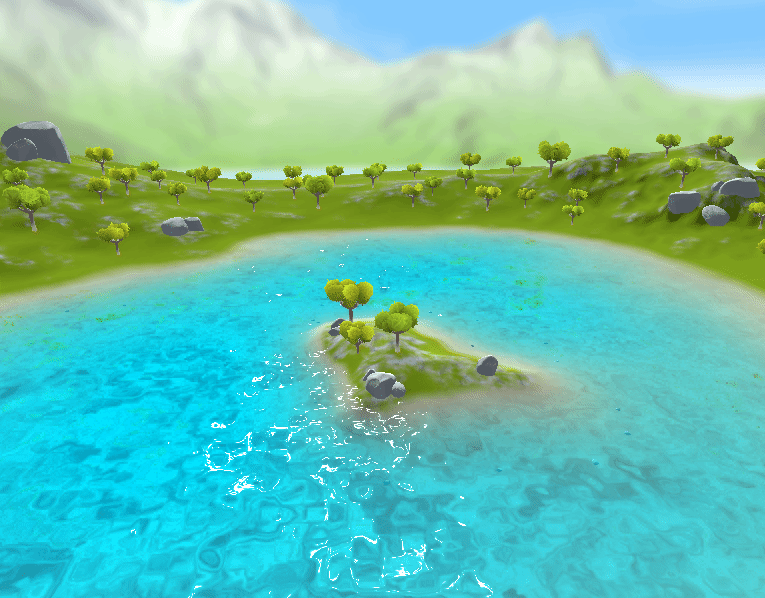
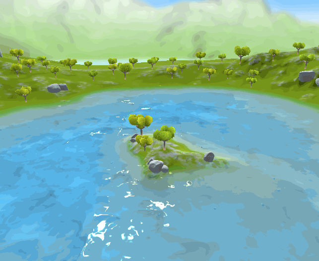

# UnityWater

### Unity下实现卡通水面、交互水面、屏幕后处理无限大水面效果
####  开发环境为Unity2018.04 LTS 版本

该Demo为技术演示Demo，仅用于参考与学习。

[更多内容欢迎知乎交流](https://www.zhihu.com/people/mai-kun-61/activities)

[知乎专栏 Unity Graphics](https://zhuanlan.zhihu.com/UnityGraphics)

[知乎专栏 爱生活爱学习](https://zhuanlan.zhihu.com/c_1155535646612492288s)

---

#### 1.卡通水
##### 1.1 

---

#### 参考链接
- https://arm-software.github.io/opengl-es-sdk-for-android/ocean_f_f_t.html?tdsourcetag=s_pcqq_aiomsg
- https://github.com/AsehesL/UnityWaveEquation
- https://github.com/SardineFish/Post-processing-Demo
- https://github.com/crest-ocean/crest
- https://zhuanlan.zhihu.com/p/88131691
- https://www.zhihu.com/question/28127528

